# Backend Workflow

This document describes the backend flow that is currently implemented in the workspace.

## End-to-End Flow

```mermaid
flowchart TD
    A[Frontend: SeedList upload button] --> B[POST /api/v1/seeds/upload]
    B --> C[seeds.py upload_seed]
    C --> D[SeedService.upload_seed]
    D --> E[Write file into SEED_DIR]
    E --> F[Frontend refreshes GET /api/v1/seeds]

    F --> G[Frontend: MutationJobForm]
    G --> H[POST /api/v1/mutants/generate]
    H --> I[mutants.py generate_mutants]
    I --> J[MutantService.generate]

    J --> K{mutator_type}
    K -->|llm| L[LLMMutator.run]
    K -->|grammar| M[GrammarMutator.run]
    K -->|random| N[RandomMutator.run]

    L --> L1[Load seed IR from SEED_DIR]
    L1 --> L2[Check Ollama availability]
    L2 --> L3[Select mutation strategy]
    L3 --> L4[Call Ollama]
    L4 --> L5[Extract and sanitize IR]
    L5 --> L5A[Pre-write IR deduplication]
    L5A --> L6[Write .ll into mutants_llm]
    L6 --> L7[Append raw_mutants.json entry]

    M --> M1[Load seed IR from SEED_DIR]
    M1 --> M2[Apply deterministic rule-based mutation]
    M2 --> M2A[Pre-write IR deduplication]
    M2A --> M3[Write .ll into mutants_grammar]
    M3 --> M4[Append raw_mutants.json entry]

    N --> N1[Load seed IR from SEED_DIR]
    N1 --> N2[Apply random mutation]
    N2 --> N2A[Pre-write IR deduplication]
    N2A --> N3[Write .ll into mutants_random]
    N3 --> N4[Append raw_mutants.json entry]

    L7 --> O[Frontend moves to ValidationStatus]
    M4 --> O
    N4 --> O

    O --> P[POST /api/v1/mutants/validate]
    P --> Q[mutants.py validate_mutants]
    Q --> R[MutantService.validate]
    R --> S[filter_valid.validate_batch]

    S --> T[Locate mutant file]
    T --> T1[Spawn isolated validation worker]
    T1 --> U[Optional rule-based prevalidation]
    U --> V[Record content hash and duplicate metadata]
    V --> W[Run llvm-as]
    W --> X[Run opt -passes=verify]
    X --> Y{Valid?}
    Y -->|yes| Z[Move .ll to valid_mutants]
    Y -->|no| AA[Move .ll to invalid_mutants]
    Z --> AB[Optional semantic triviality check]
    AA --> AC[Skip triviality check]
    AB --> AD[Append validity_logs.json entry]
    AC --> AD

    AD --> AE[Auto-refresh logs manifest]
    AE --> AF[Optional GET /api/v1/analysis/manifest]
    AF --> AG[ManifestTracker aggregates raw_mutants.json and validity_logs.json]
    AG --> AH[Write backend/data/logs/manifest.json]
```

## Request Sequence

1. The frontend uploads a `.ll` file with `POST /api/v1/seeds/upload`.
2. The backend writes the uploaded file into `SEED_DIR` through `SeedService.upload_seed`.
3. The frontend reloads `GET /api/v1/seeds` and shows the new seed.
4. The user submits a generation job with `POST /api/v1/mutants/generate`.
5. `MutantService.generate` dispatches to `LLMMutator`, `GrammarMutator`, or `RandomMutator`.
6. Generated mutants are deduplicated before write, then written into the mutator-specific directory and logged to `backend/data/logs/raw_mutants.json`.
7. The frontend sends the generated mutant IDs to `POST /api/v1/mutants/validate`.
8. `filter_valid.validate_batch` validates each mutant in an isolated worker, moves it into `valid_mutants/` or `invalid_mutants/`, appends a row to `backend/data/logs/validity_logs.json`, and refreshes the manifest snapshot.
9. `GET /api/v1/analysis/manifest` returns the latest aggregated manifest and can also regenerate it on demand.

## Runtime Artifacts

- Uploaded seeds: `backend/data/seeds/`
- LLM mutants before validation: `backend/data/mutants_llm/`
- Grammar mutants before validation: `backend/data/mutants_grammar/`
- Random mutants before validation: `backend/data/mutants_random/`
- Valid mutants after validation: `backend/data/valid_mutants/`
- Invalid mutants after validation: `backend/data/invalid_mutants/`
- Generation log: `backend/data/logs/raw_mutants.json`
- Validation log: `backend/data/logs/validity_logs.json`
- Aggregated manifest: `backend/data/logs/manifest.json`

## Important Current Behavior

- The frontend now exposes `llm`, `grammar`, and `random` in the main mutation workflow.
- Duplicate detection now happens before mutant files are written, while validation still records hash metadata.
- Manifest generation now happens automatically after validation batches and remains available on demand through the analysis endpoint.
